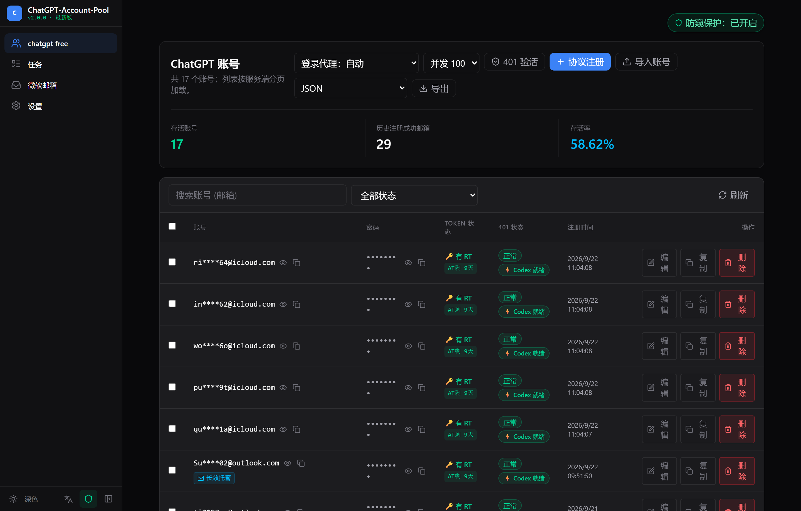
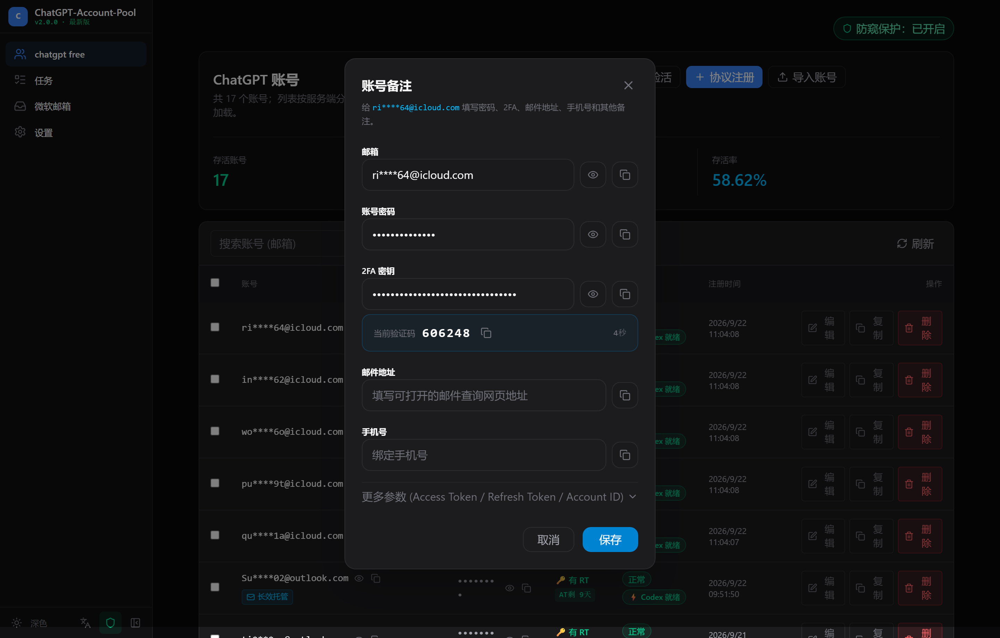
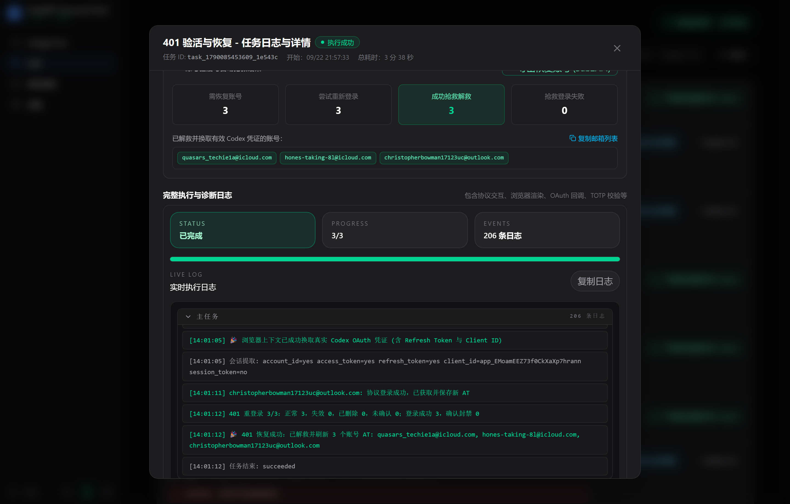
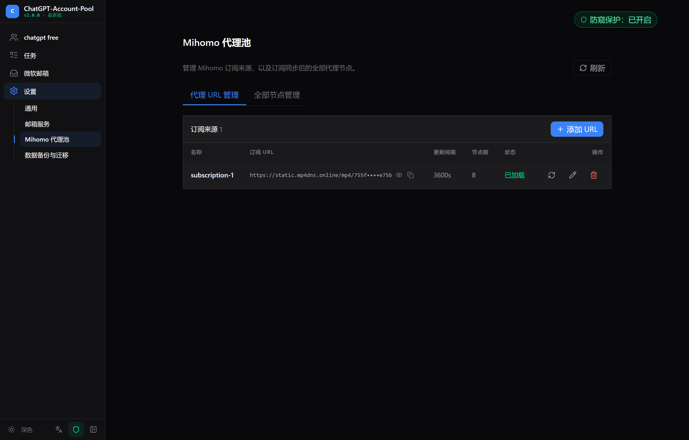
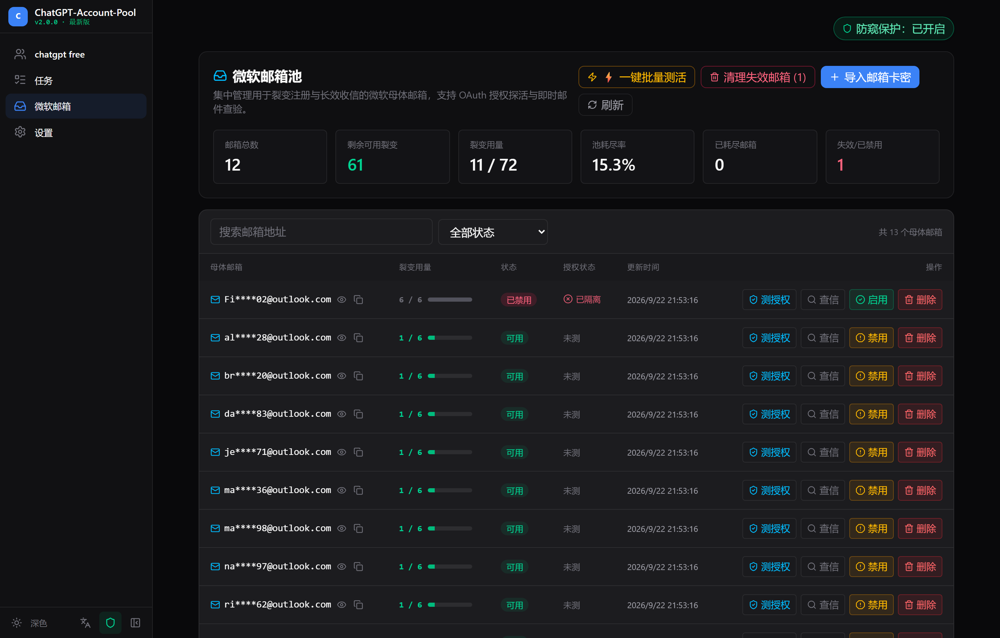

# ChatGPT-Account-Pool

<div align="center">

# 🚀 ChatGPT-Account-Pool
### 高可用 ChatGPT 账号池与 Token 智能维护系统
**High-Availability ChatGPT Account & Token Pool with Auto-Refresh, Codex Direct Connect, Camoufox Turnstile Solver & Mihomo Proxy Integration**

[](https://github.com/SeiShonagon520/ChatGPT-Account-Pool)
[](https://github.com/SeiShonagon520/ChatGPT-Account-Pool/releases)
[](https://www.python.org/)
[](docker-compose.yml)
[](https://fastapi.tiangolo.com/)
[](frontend/)
[](LICENSE)

[English](#-english-overview) · [简体中文](#-项目简介) · [界面预览](#-界面预览-screenshots) · [核心特性](#-核心特性) · [快速开始](#-快速开始-docker-compose) · [API 文档](#-api-接口与下游集成)

</div>

---

## 📖 项目简介

**ChatGPT-Account-Pool** 是一套专为生产环境与大模型中转站（如 One-API / New-API / chatgpt2api / Cockpit Tools）打造的**高可用 ChatGPT 账号资产池与 Token 智能调度管理系统**。

面对 OpenAI 严格的风控、Cloudflare Turnstile 验证盾、节点黑名单、401 令牌失效以及下游 Cockpit 工具直连鉴权难题，本项目将**协议高速直连**、**Camoufox 真实指纹浏览器**、**Codex 官方长效 Refresh Token 静默签发**、**Mihomo (Clash) 代理池原生协同**、**前端全局防偷窥脱敏**以及**微软母体邮箱池**深度融合，实现账号从**自动注册、存活监测、失效抢救、过盾自愈到下游分发**的全生命周期自动化运作。

---

## 📸 界面预览 (Screenshots)

<div align="center">

### 1. 账号资产看板与 Codex 直连双状态监控 (内置防偷窥保护)


> *全景展示存活率与账号资产，实时追踪 Web UI 与 `⚡️ Codex 直连就绪` 双状态。右上角常驻全局防窥开关，敏感邮箱与密码智能掩码脱敏。*

<br/>

### 2. 账号详情抽屉与 2FA TOTP 动态码实时生成


> *支持查看与编辑凭证参数，内置 TOTP 算法，**实时计算并展示 6 位动态验证码（带秒级倒计时圆环）**，单项眼睛图标支持随时临时查看与安全明文复制。*

<br/>

### 3. 401 验活抢救全链路诊断日志与凭据提取


> *实时任务流与可视化指标看板，详尽追踪协议交互、Camoufox 浏览器渲染及 Codex 凭据换取细节，精准定位失败根因并提供专用导出。*

<br/>

### 4. 原生 Mihomo 代理池管理与智能 Slot 分流


> *原生集成 Metacubex Mihomo 核心，支持标准 Clash 订阅导入与自动脱敏防护，实现多 Slot 端口分流与遭遇 429 频控时的自适应节点轮换。*

<br/>

### 5. 微软母体邮箱池与裂变用量监控


> *集中管控裂变注册母体邮箱，支持高并发批量 OAuth 探活、失效隔离与实时用量看板预警。*

</div>

---

## ✨ 核心特性

### 1. ⚡ 401 深度验活与 Codex 官方直连双状态体系
- **AT、RT、网页与 Codex 状态分开记录**：Access Token（AT）验活、Refresh Token（RT）检查、网页工作区状态和 Codex 接口状态分别呈现。没有实际请求 RT 时显示“未检查”，不会用 AT 结果代替 RT 结果。
- **按证据恢复凭据**：先检查 AT；AT 可用时不触发登录。AT 失效或缺失时，优先尝试已保存 RT，并保存接口返回的轮换凭据；RT 被明确判定失效后，再用账号密码与邮箱验证码/TOTP 重新登录，必要时回退到 Camoufox。
- **保守分类认证响应**：普通 403、Cloudflare 挑战、限流及网络错误记为未确认；工作区 402 单独标记为受限，不据此认定 AT 失效。RT 只有在响应明确拒绝凭据时才标记失效。
- **缺少验证邮箱时保留账号**：没有可用邮箱/TOTP 时不删除账号，标记“待补邮箱 / TOTP”；再次检查仍先尝试 RT，只有 RT 也无法恢复时才停止密码/验证码登录。
- **状态徽章与任务进度**：列表分别显示 AT、WEB、RT、Codex 状态及待补资料/待复查标记；任务统计使用“尝试恢复凭据”，覆盖 RT 刷新与登录恢复。

### 2. 🔄 Camoufox 真实指纹浏览器与静默 PKCE 签发长效 RT
- **内置指纹浏览器**：采用 Camoufox (定制防检测 Firefox 内核)，完美绕过浏览器特征指纹与 Cloudflare Turnstile 人机盾。
- **静默换取 Codex 凭据 (Silent PKCE Minting)**：在 Camoufox 浏览器已通过验证并成功登录的会话上下文下，自动构造 Codex 官方 OAuth 授权请求并拦截回调，通过带官方指纹的客户端换取带官方 `client_id=app_EMoamEEZ73f0CkXaXp7hrann` 的长效 Refresh Token。救活后的账号无缝兼容 Cockpit 直连。

### 3. 🛡️ Cockpit / Sub2API 导出安全拦截守卫 (Export Safety Guard)
- **就绪度预检拦截**：用户批量导出 `sub2api` 或 `cockpit` 配置时，系统自动预检选中账号是否缺少 Refresh Token、Client ID 是否属于官方客户端以及 Codex 接口是否有效。
- **一键智能过滤**：拦截弹窗清晰列出未就绪账号及具体原因，并提供**【仅导出 Codex 正常账号】**快捷按钮，杜绝失效凭据污染生产下游。

### 4. 🛡️ 前端全局“防偷窥 / 隐私脱敏模式” (Privacy Masking Mode)
- **全局一键开关**：界面顶部醒目常驻 `[ 🛡️ 防窥保护：已开启 / 已关闭 ]` 胶囊按钮，状态在本地 `localStorage` 持久化，适用于演示、截屏与日常防窥。
- **智能关键位脱敏**：
  - **代理订阅 URL**：自动遮蔽长串 Token，仅保留域名特征与前后字符。
  - **账号密码**：统一掩码显示为 `••••••••`。
  - **账号邮箱 / 微软邮箱**：智能保留首尾字符打码（如 `qu****1a@icloud.com`）。
  - **2FA 秘钥 / 备注**：敏感位遮蔽。
- **单项眼睛显隐与安全明文复制**：每个字段配备眼睛图标独立临时显隐；**复制按钮复制的永远是真实完整的明文字符串**，完全不影响日常导入与配置使用。

### 5. 🌐 原生 Mihomo 代理池集成与智能 Slot 轮换
- **双容器协同架构**：`app` 与 `mihomo` 容器原生互通，一键 Docker Compose 启动即自带专业代理调度能力。
- **标准订阅一键同步**：支持 Clash / Mihomo 订阅链接，自动解析 Hysteria2 / Vless / SS / Trojan 等全协议节点。
- **自适应频控轮换**：遇到 OpenAI 登录频控（Rate Limit / 429）或节点阻断时，自动在干净节点间轮换并执行退避重试。

### 6. 🔍 账号详情抽屉与 2FA TOTP 动态码实时生成
- **一键查看详情**：点击列表右侧「编辑」按钮，进入账号细节参数抽屉。
- **实时 2FA 动态码**：只要账号绑定了 TOTP Secret，前端**实时计算并展示 6 位动态验证码**，提供实时倒计时与一键复制功能。
- **便捷编辑**：支持修改账号密码、添加自定义备注、更新 Token，方便人工介入与凭据维护。

### 7. 📬 微软母体邮箱池与裂变用量监控
- **一键批量测活**：对邮箱池内所有微软母体邮箱（Outlook / Hotmail）发起高并发 OAuth 探活，自动检测凭据有效性。
- **失效邮箱隔离**：测活失败或鉴权失效的邮箱自动置为「已隔离」并禁用，防止裂变注册任务中断。
- **用量仪表盘**：实时统计母体总数、剩余可用裂变次数、已用/总限额比例，并在配额告急时醒目预警。

### 8. 📋 任务实时监控与全链路诊断日志
- **多状态回溯**：支持「运行中 / 已完成 / 全部任务」分类筛选，任务结束后历史记录持久化保存。
- **全景恢复详情**：直观展示 401 验活抢救指标（需恢复数、尝试登录数、成功解救数、失败数），支持一键复制成功账号与专用导出。
- **智能错误定位**：内置底层诊断日志面板，记录浏览器上下文、OAuth 换证步骤及网络交互明细，支持一键复制完整日志。

### 9. 🔐 账号数据库加密快照与跨机迁移
- **加密快照**：使用 PBKDF2 与 XSalsa20-Poly1305 认证加密，打包 SQLite 事务快照、元数据清单以及解密主密钥生成 `.fgmbak` 文件。
- **跨机无损迁移**：新设备一键恢复，直接无损解密全部敏感凭据。

---

## 🚀 快速开始 (Docker Compose)

推荐使用 Docker Compose 进行一键部署，开箱即用：

### 1. 克隆代码仓库
```bash
git clone https://github.com/SeiShonagon520/ChatGPT-Account-Pool.git chatgpt-account-pool
cd chatgpt-account-pool
```

### 2. 配置环境变量
```bash
cp .env.example .env
# 编辑 .env 文件，设置访问密码（APP_PASSWORD）等参数
```

### 3. 启动容器集群
```bash
docker compose up -d
```

### 4. 初始化 Camoufox 浏览器内核（首次启动需要）
```bash
docker compose exec app python -m camoufox fetch
```

访问 `http://localhost:8000` 即可进入管理面板！

---

## 💻 本地开发部署

### 环境要求
- **Python** 3.11+
- **Node.js** 18+ 与 npm
- **Camoufox** 依赖

```bash
# 1. 安装 Python 依赖
python -m venv .venv
source .venv/bin/activate  # Windows: .\.venv\Scripts\Activate.ps1
pip install -r requirements.txt
python -m camoufox fetch

# 2. 安装并构建前端
cd frontend
npm install
npm run build
cd ..

# 3. 启动后端服务
python main.py
```

---

## 🔌 API 接口与下游集成

本项目提供标准的 RESTful API，可无缝对接 **One-API**、**New-API**、**Cockpit Tools** 或第三方聚合分发平台：

| 接口端点 | 方法 | 说明 |
| :--- | :--- | :--- |
| `/api/accounts` | `GET` | 获取账号列表，支持状态筛选与分页 |
| `/api/accounts/export` | `GET` | 批量导出账号（支持 json, sub2api, cpa 等格式） |
| `/api/accounts/export/check-codex-readiness` | `POST` | 批量预检账号 Codex 直连就绪度与 Refresh Token 有效性 |
| `/api/accounts/check-refresh-tokens` | `POST` | 触发 401 深度验活与自动抢救任务（支持 Camoufox 静默换证） |
| `/api/accounts/import` | `POST` | 批量导入账号（支持 JSON / Sub / CPA / 纯文本） |
| `/api/mihomo/proxies` | `GET` | 获取当前 Mihomo 代理池节点与延迟状态 |
| `/api/tasks` | `GET` | 获取后台任务列表、恢复统计与全链路执行日志 |

---

## 🌐 English Overview

**ChatGPT-Account-Pool** is a production-grade, high-availability ChatGPT account pool and token maintenance platform designed for developers, LLM gateways (such as One-API and New-API), and Codex direct connect clients (such as Cockpit Tools).

### Key Highlights:
- **Separate AT, RT, Web, and Codex Statuses**: Access Token checks, actual Refresh Token checks, workspace access, and Codex endpoint readiness are reported independently. An unchecked RT is never inferred as valid from an AT result.
- **Evidence-based 401 Recovery**: Checks the AT first; when it is invalid or missing, tries the stored RT before password-based login. Explicit RT rejection can fall back to password plus email OTP/TOTP, with Camoufox as a browser fallback when available.
- **Conservative Authentication Classification**: Unclassified 403 responses, Cloudflare challenges, rate limits, and network errors remain inconclusive. Workspace 402 is reported as restricted rather than proof of an invalid AT.
- **Mailbox-safe Recovery**: Accounts without a usable mailbox or TOTP are retained and marked for follow-up. Later checks still try RT refresh before skipping password-based recovery.
- **Account Status and Recovery Progress**: The UI separates AT, Web, RT, and Codex badges and reports pending mailbox/RT follow-up states.
- **Silent PKCE Long-lived Token Minting**: Camoufox browser context silently initiates official OAuth PKCE flow to acquire official Codex `client_id=app_EMoamEEZ73f0CkXaXp7hrann` Refresh Tokens.
- **Export Safety Guard**: Pre-checks accounts during export to prevent unready or invalid credentials from entering production.
- **Global Privacy Protection Mode**: Intelligent front-end masking for proxy subscription URLs, passwords, emails, and 2FA secrets with one-click toggle and plaintext copy.
- **Native Mihomo Proxy Pool**: Dual-container architecture with native proxy subscription, slot port mapping, latency testing, and auto-rotation on rate limits or IP blocks.
- **Universal Import/Export**: Supports JSON, Sub2API, CPA, and plaintext formats.
- **Real-time 2FA**: Live TOTP 6-digit code generator with countdown directly on the web UI.

---

## ⚠️ 免责声明 (Disclaimer)

本项目仅供学术研究、接口测试与自动化运维学习交流使用。请严格遵守 OpenAI 服务条款以及当地法律法规。使用本项目产生的任何后果由使用者自行承担，与项目开发者无关。

---

## 📄 开源协议 (License)

本项目基于 [AGPL-3.0 License](LICENSE) 开源。
